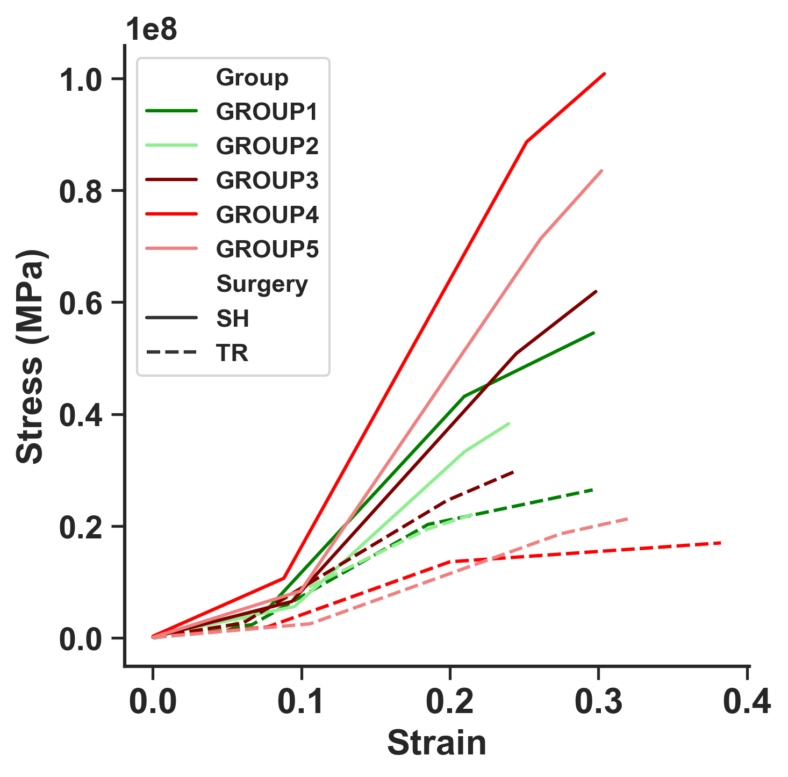
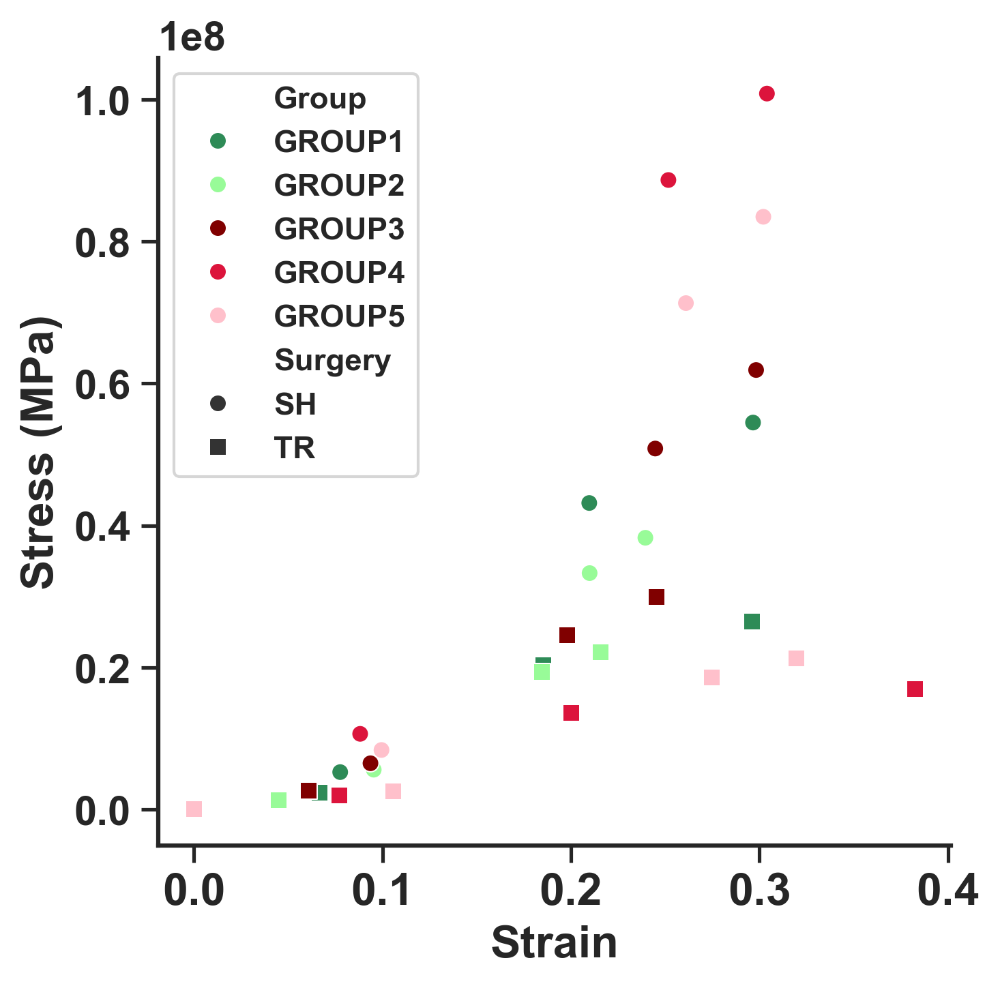

# readyplot: publication-ready data visualization
Readyplot is a Python figure-creation library based on seaborn. It provides publication-quality defaults which match
the esthetic provided by other standalone figure-creation software, but can be integrated into Python data-pipelines
to automate figure creation and bridge the gap between procedural data exploration and figure polishing.

# Background
The readyplot project was born out of the desire to help automate publication-ready figure creation in Python.
A useful paradigm is that readyplot is to seaborn (sns) what seaborn is to matplotlib.pyplot (plt).
Many researchers tediously copy-paste data into existing plotting software and thus risk poor data handling at worst
or wasted time at best when they inevitably decide to add exclusion criteria or change esthetics. 
This package integrates into data-processing pipelines seamlessly without sacrificing figure quality for those who 
expect publication quality figures. While readyplot offers many options and passes kwargs to its sns functions, the goal
is for the defaults to be fine-tuned such that the user doesn't need to specify anything other than contextual
options such as figure width and height. Nothing feels quite as good as watching your output folder auto-populate
with readyplot figures which are perfect for both data exploration and publication!



# Installation

You can install the package via pip:

```bash
pip install readyplot
````
## Dependencies
This package depends on matplotlib, numpy, pandas, seaborn, scipy, pathlib, and setuptools.
If you do not have these packages in your environment, you can install with pip install package 
(replace package with your missing dependency).
# Usage
## Importing and suggested nickname:
```{python}
import readyplot as rp
```

## Initializing:
```{python}
# IF PASSING DATA FRAME DF:
plotter = rp.boxwhisker(DFs=DF) #Many possible arguments to add on initialization
# IF PASSING X,Y,Z DATA:
plotter = rp.boxwhisker(x=x,y=y,z=z) #All **kwargs are passed on to the coressponding sns plotting function
```
## Available plotters and corresponding sns functions:
```{python}
plotter = rp.bar(x=x,y=y,z=z)           #sns.barplot()
plotter = rp.boxwhsker(x=x,y=y,z=z)     #sns.boxplot()
plotter = rp.hist(x=x,y=y,z=z)          #sns.histplot()
plotter = rp.line(x=x,y=y,z=z)          #sns.lineplot()
plotter = rp.scatter(x=x,y=y,z=z)       #sns.scatterplot()
```
## Quick example:
```{python}
x = ['A','A','A','B','B','B','B','A','B','B']
y=[1,2,3,4,5,8,4,3,2,9]
z = ['C','D','C','D','C','D','C','D','C','D']
box_plotter = rp.boxwhisker(x=x,y=y,z=z,ylab='your variable here',handles_in_legend=2)
box_plotter.plot()

# OR: fig,ax = box_plotter.plot() if you want to handle the figure afterward
```
## Flexible example (plot() calls these behind the scenes):
```{python}
x = ['A','A','A','B','B','B','B','A','B','B']
y=[1,2,3,4,5,8,4,3,2,9]
z = ['C','D','C','D','C','D','C','D','C','D']
box_plotter = rp.boxwhisker(x=x,y=y,z=z,ylab='your variable here',handles_in_legend=2)
box_plotter.pre_format()
box_plotter.just_plot()
box_plotter.post_format()
box_plotter.show()
box_plotter.save()

# OR: fig,ax = box_plotter.just_plot() for any of the functions above except initialization
```
---
# Important input options
- **DFs, or x,y,z**: Input data frame or multiple lists/numpy arrays.
- **xlab,ylab,zlab**: String labels for different axes (zlab is for hues/styles); for DFs must match DataFrame column 
names! While not required fields, if you are getting unexpected behavior, consider adding labs, it may fix your problem.
- **colors**: List of colors to use, use matplotlib color strings ('crimson','green','salmon', etc...)
- **markers**: List of markers to use, use matplotlib marker strings ('o','s','*', etc...)
- **hatches**: List of hatches to use, use matplotlib patch hatch strings ('//','...','--') (only bar plots)
- **def_font_sz,def_line_w**: Default font sizes and line widths for figure creation (some parameters scale with this)
- **folder_name**: String name of output folder to create or overwrite, currently applied to current directory (future
support for custom directories)
- **dpi**: Resolution of figures (int)
- **sns_palette,sns_style,sns_context**: Default sns esthetic controls applied in pre-formatiting
- **fontweight**: By default is 'bold' but can can be reset to non-bold by the user
- **box_edges**: List of strings for which axes to show, by default ['bottom','left']
- **fig_width,fig_height**: Width and height of figures
- **xtick_font_ratio,ytick_font_ratio**: Font ratios for axes
- **x_exp_location,y_exp_location**: Location of floating scientific exponent at the axes' tips
- **annote_x_start,annote_y_start**: Coordinates for first automated annotation such as R2 values on trendline
(subsequent annotations are programmatically spaced beneath this)
- **low_x_cap0,low_y_cap0**: Scientific tick number handling is strange, but readyplot provides some background
functionality by modulating the axis limits and bin numbers. Setting these low cap0s to True prevents the axis limits
from being set below 0 within these back-end functions (for example if you have data that is never negative)
- **dodge**: Dodge behavior (default True) for marker overlays in bar and box plots
- **handles_in_legend**: Int limiting the maximum number of legend entries, useful if overlays create extra redundant
legend entries
- **box_width**: Number between 0 and 1 describing how much of available width space boxes will take up
- **custom_x_label,custom_y_label**: Custom axis labels that may not match the Dataframe column names
- **title**: Custom title
- **sci_x_lims,sci_y_lims**: (m,n) where m and n are the powers for 10**m and 10**n describing the limits that must be
breached in order to convert to scientific formatting. By default (0,1), so anything beneath 1 and above 10 will trigger
scientific axes ticks. Setting m=n will force all plots to be scientific
- **capsize**: Size of error bar caps for the barplots
- **kwargs**: kwargs for underlying sns functions can be passed to plot() and just_plot()
- **input_fig,input_ax**: NOT YET FUNCTIONAL, FUTURE PASSING FIGURES INTO READYPLOT INITIALIZATION
---
# NOTES:
- **Modularity**: Each plot type (`ScatterPlotter`, `LinePlotter`) is its own class that inherits from a shared `BasePlotter`, making it easy to extend in the future with other types of plots.
- **Customization**: Users can easily customize plot styles, colors, labels, etc., through constructor parameters.
---
# Conclusion
Happy plotting! Feel free to suggest additional features or plot types if needed! Readyplot currently includes most
plotting types I use on a daily basis, but I'd be happy to expand readyplot to match the community's needs.
                                